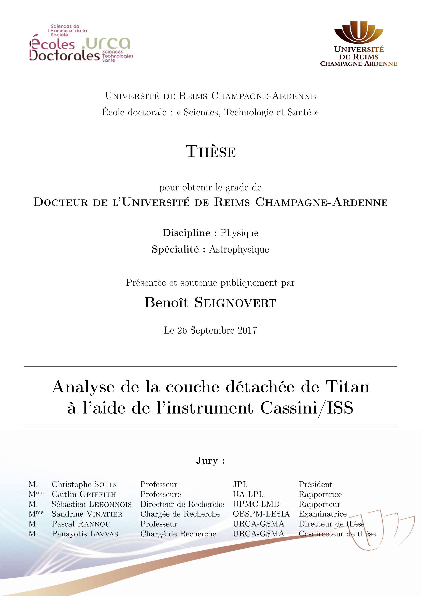

# PhD cover page for the [doctoral school of Reims (URCA)](http://www.univ-reims.fr/recherche-et-valorisation/ecoles-doctorales/les-ecoles-doctorales,8712,16338.html)

[](https://github.com/seignovert/phd-cover-urca/releases/latest)

LaTeX template for the front and back pages of my PhD thesis:

## Usage
You only need to copy:
- `cover.sty` for the template
- `cover.tex` for the data
- `logo_ed.png` and `logo_univ.png` for the logos
- `footer.png` for the watermark

[](https://github.com/seignovert/phd-cover-urca/releases/download/v1.0/phd-cover-urca.zip)


Add `\usepackage{cover}` in your preambule and after `\begin{document}` add:
```latex
\frontmatter
\frontcover
```
To insert your cover page and add automatically a blank page.

Then, the main document should be preceded by:
```latex
\mainmatter
% Place your main document here
```

Finally add:
```latex
\backmatter
\backcover
```
To pu the back page at the end of the document (on the left side).

Refer to the `example.tex` if needed.

## Cover page


## Back page


## More info
- [La thèse électronique en LaTeX by J. Hare](https://www.edpif.org/documents/latex/PolyThElecLatex.pdf)
